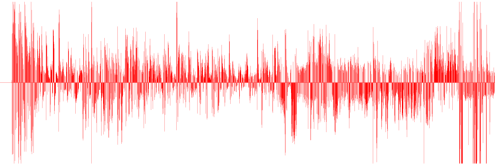
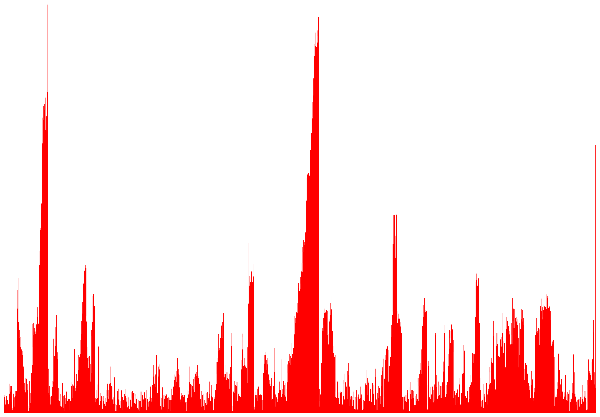

# go-hist
simple go program to draw histograms

Installation
-----------

	go get github.com/xigh/go-hist

Documentation
-----------

	Usage:

	  ./hist [options...] <file>

	  -endian="little": endianess: [little, big]
	  -gather="max": data gathering: [max, avg]
	  -height=1000: image height
	  -hmargin=10: horizontal margin
	  -length=2147483647: max number of lines
	  -lspace=0: space between lines
	  -lwidth=1: line width
	  -out="out.png": output filename
	  -skip=0: number of entry to skip
	  -type="text": datatype: [i8, u8, i16, u16, i32, u32, f32, f64, text]
	  -vmargin=10: vertical margin
	  -width=0: force image width [overrides line width]

Examples
-----------

Files can be binary files, such as raw audio track:

	./hist --type i16 --length 2000000 --width 3000 --out audio.png audio.raw
	scanning input
	c=2000000 min=-32768.000000 max=32767.000000 avg=0.233254 zero=32768.00, vpl=671.14 [3000x1000]
	generating background
	processing image
	audio.png saved 9192709px

Files can also be floats in text format:

        cat hist.txt
	1.35
	1.50
	1.09
	0.73
	1.59
	1.43
	1.21
	1.11
	1.11
	0.68
	0.82
	1.82
	1.64
	2.46
	1.81
	2.26
	1.63
	...
	
	./hist ../51130591/hist.txt 
	scanning input
	c=1418 min=0.150000 max=33.670000 avg=4.360035 zero=0.00, vpl=1.00 [1438x1000]
	generating background
	processing image
	out.png saved 179241px

Bugs
-----------

Yes.
